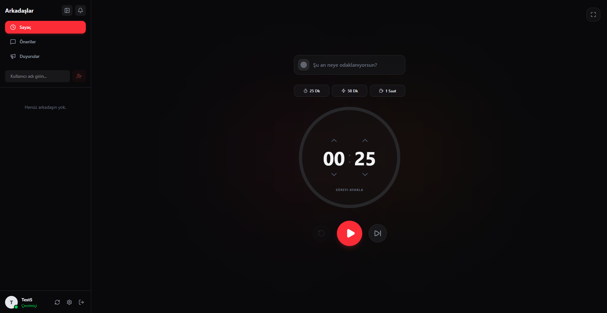

# 🍅 PomoV1 - Gelişmiş Pomodoro & Odaklanma Uygulaması

PomoV1, geliştiriciler ve öğrenciler için tasarlanmış, modern bir arayüze sahip, çapraz platform (cross-platform) bir masaüstü Pomodoro uygulamasıdır. Kullanıcıların odaklanma sürelerini takip etmelerini, görevlerini yönetmelerini ve mola sürelerini optimize etmelerini sağlar.

Hem şık bir masaüstü deneyimi sunmak hem de verileri güvenli bir şekilde senkronize etmek için modern web teknolojileri (React, Electron) ve güçlü bir backend (Node.js, MongoDB) mimarisi ile geliştirilmiştir.

---

## 📸 Uygulama Görseli

<!-- NOT: Aşağıdaki parantez içine görselinin yolunu veya linkini yapıştır (Örn: ./assets/screenshot.png) -->


---

## ✨ Öne Çıkan Özellikler

- **Sosyal Odaklanma & Arkadaş Sistemi:** Çalışma motivasyonunu en üst düzeye çıkarmak için arkadaş ekleme altyapısı. Arkadaşlarınızın aktif odaklanma durumlarını takip edebilir ve birlikte senkronize çalışma rutinleri oluşturabilirsiniz.
- **Dinamik Zamanlayıcı & Modlar:** Odaklanma (Focus) ve Mola (Break) modları arasında kesintisiz geçiş. Modlara göre değişen dinamik atmosfer ışıkları ve renk temaları.
- **Kesintisiz Sesli Bildirimler:** Global ses mimarisi sayesinde, uygulama içi sayfa değişimlerinde (routing) bile kopmayan ve her ekrandan yönetilebilen asenkron alarm sistemi.
- **Hızlı Ön Ayarlar:** Tek tıkla 25 dk, 50 dk veya 1 saatlik odaklanma seansları başlatma.
- **Özelleştirilebilir Ayarlar:** Kullanıcının çalışma rutinlerine göre şekillenebilen süre, otomatik geçiş ve bildirim konfigürasyonları.
- **Tam Ekran Desteği:** Dikkati tamamen işe vermek için tek tıkla izole (Full Screen) odak modu.
- **Otomatik Güncelleme (Auto-Updater):** GitHub Releases entegrasyonu ile uygulamanın yeni sürümlerini arka planda algılama ve kullanıcı deneyimini kesintiye uğratmadan otomatik sürüm yükseltme (OTA Updates).
- **Senkronize Backend:** Kullanıcı verilerini, arkadaş listelerini ve yapılandırmaları bulutta tutan, güvenli ve optimize edilmiş REST API altyapısı.

---

## 🛠 Kullanılan Teknolojiler

### Frontend (Masaüstü İstemci)
- **Electron.js:** Masaüstü uygulama altyapısı, sistem seviyesi entegrasyonlar ve pencere yönetimi.
- **React & Vite:** Yüksek performanslı, modern ve bileşen tabanlı kullanıcı arayüzü (UI) inşası.
- **Zustand:** Uygulama genelinde karmaşık veri akışını (Global State Management) optimize etmek için hafif ve reaktif state mimarisi.
- **Tailwind CSS:** Modern, duyarlı (responsive) ve dinamik tasarım (Design System) standartları.
- **Framer Motion:** Akıcı UI/UX animasyonları, durum geçişleri ve mikro etkileşimler.
- **Lucide React:** Minimalist ve vektörel ikon seti.
- **Electron-Builder & Updater:** CI/CD süreçleri, uygulama paketleme ve otomatik dağıtım.

### Backend (API Sunucusu)
- **Node.js & Express.js:** Hızlı, ölçeklenebilir ve olay tabanlı (event-driven) RESTful API mimarisi.
- **MongoDB & Mongoose:** Esnek veri modellemesi ve NoSQL veritabanı yönetimi.

---

## 🚀 Geliştirme Sürecinde Çözülen Temel Mühendislik Problemleri

Bu proje geliştirilirken karşılaşılan zorluklar modern yazılım prensipleriyle çözülmüştür:
1. **Component Lifecycle & Memory Management:** React bileşenleri arası sayfa değişiminde (unmount) kaybolan medya referansları, Global Instance mimarisi ile çözülerek bellekte asılı kalan (memory leak) süreçler engellendi ve medya kontrolü merkeze alındı.
2. **Backend Veri Optimizasyonu:** Veritabanı tarafında yaşanan tekrarlı anahtar (Duplicate Key) çakışmaları, şema (Schema) yeniden yapılandırması ve indeksleme (Indexing) stratejileri ile giderildi.
3. **Versiyonlama & CI/CD Pipeline:** İstemci ve sunucu mimarileri bağımsız repolara ayrılarak mikroservis mantığına yaklaştırıldı. Semantic Versioning (SemVer) standartları benimsenerek, CLI üzerinden tek komutla çalışan otomatik derleme ve dağıtım (Build & Publish) otomasyonu kuruldu.

---

## 📦 Kurulum ve Çalıştırma

Uygulamanın backend (API) altyapısı **Render** üzerinde bulut tabanlı ve canlı (production) olarak çalıştığı için yerelde herhangi bir veritabanı veya sunucu kurulumuna gerek yoktur. Uygulamayı indirdiğiniz an bulut sistemine otomatik olarak bağlanır.

### 🖥️ Son Kullanıcılar İçin (İndir ve Kullan)
Uygulamayı bilgisayarınıza kurup hemen odaklanmaya başlamak için:
1. GitHub **[Releases](../../releases)** sayfasına gidin.
2. En güncel sürüme ait `.exe` uzantılı kurulum dosyasını indirin.
3. Kurulumu tamamlayıp PomoV1'i başlatın.

### 👨‍💻 Geliştiriciler İçin (Kaynak Koduyla Çalıştırma)
Projeyi kendi yerel ortamınızda geliştirici (development) modunda çalıştırmak isterseniz:

```bash
# Repoyu bilgisayarınıza klonlayın
git clone https://github.com/aenes-dev/PomoV1.git

# Bağımlılıkları yükleyin
npm install

# Geliştirici modunda başlatın
npm run dev
